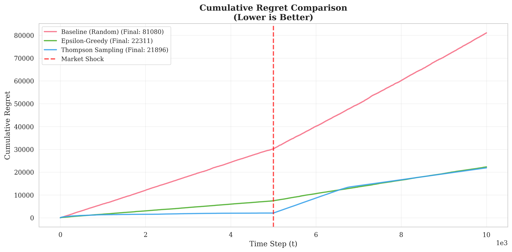
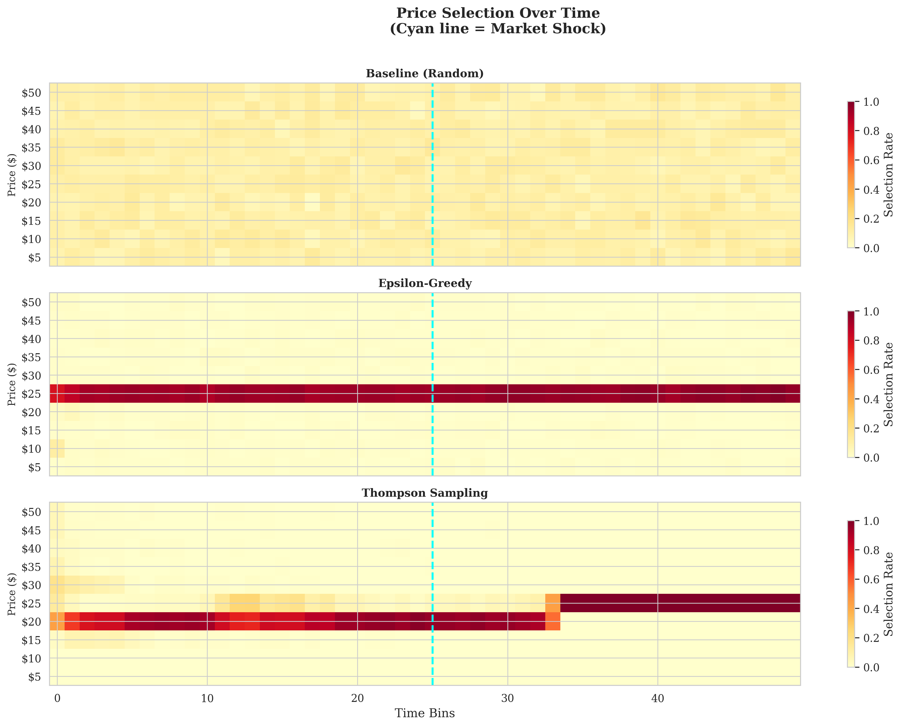

# Adaptive Pricing in Non-Stationary Markets: An RL Experiment


A modular, academic-grade simulation framework for comparing **Multi-Armed Bandit (MAB)** algorithms in dynamic pricing environments with non-stationary market conditions.

---

## Abstract

This project simulates a real-time pricing engine where algorithms must learn optimal prices from customer purchase feedback. We compare three approaches:

| Algorithm | Type | Key Feature |
|-----------|------|-------------|
| **Baseline** | Random | No learning (control group) |
| **ε-Greedy** | Frequentist | Explores with probability ε |
| **Thompson Sampling** | Bayesian | Samples from posterior beliefs |

The environment includes a **market shock mechanism** that abruptly changes optimal prices mid-simulation (e.g., hyperinflation), testing each algorithm's adaptation capacity.

---

## Key Finding: Bayesian Inertia 🔬

> **Why does ε-Greedy outperform Thompson Sampling after a market shock?**

Our simulation reveals a phenomenon we call **"Bayesian Inertia"** (also known as "Posterior Lock-in"):

1. **Before Shock**: Thompson Sampling learns efficiently, building strong posterior beliefs (high α, β values in Beta distributions).

2. **After Shock**: When market conditions change abruptly, Thompson Sampling's **concentrated posteriors** resist new evidence. The algorithm becomes "overconfident" in outdated beliefs.

3. **ε-Greedy Advantage**: The constant ε exploration rate forces continued exploration regardless of past performance, enabling faster adaptation.

### Cumulative Regret Comparison



*Red dashed line indicates market shock at t=5,000*

### Price Selection Heatmap



*Notice how ε-Greedy (middle) continues exploring after the shock, while Thompson Sampling (bottom) remains locked to pre-shock optimal prices*

---

## Installation & Usage

### Prerequisites
- Python 3.9+
- pip

### Quick Start

```bash
# Clone the repository
git clone https://github.com/mefedursun/dynamic-pricing-engine.git
cd dynamic-pricing-engine

# Install dependencies
pip install -r requirements.txt

# Run the simulation
python main.py
```

### Output
- Console: Simulation progress, summary statistics
- `output/`: Three publication-quality PNG plots

---

## Project Structure

```
dynamic-pricing-engine/
├── pricing_engine/
│   ├── __init__.py         # Package exports
│   ├── environment.py      # MarketEnvironment (Sigmoid demand + shocks)
│   ├── agents.py           # MAB agents (Baseline, ε-Greedy, Thompson)
│   ├── simulation.py       # SimulationEngine with metric collection
│   └── analysis.py         # Publication-quality visualization
├── main.py                 # Entry point
├── requirements.txt        # Dependencies
├── LICENSE                 # MIT License
└── README.md               # This file
```

---

## Mathematical Background

### Demand Curve (Sigmoid)

$$P(\text{buy} \mid p) = \frac{1}{1 + e^{k(p - p_0)}}$$

where:
- $p_0$: Price at 50% purchase probability
- $k$: Customer price sensitivity

### Thompson Sampling Update Rule

For Bernoulli outcomes with Beta prior:

$$\theta_a \sim \text{Beta}(\alpha_a, \beta_a)$$

**Update:**
- Sale: $\alpha_a \leftarrow \alpha_a + 1$
- No sale: $\beta_a \leftarrow \beta_a + 1$

**Action Selection:**
$$a^* = \arg\max_a \left( p_a \cdot \hat{\theta}_a \right), \quad \hat{\theta}_a \sim \text{Beta}(\alpha_a, \beta_a)$$

---

## Future Work

- [ ] Sliding-window Thompson Sampling (forgetting factor)
- [ ] Discounted UCB for non-stationary environments
- [ ] Change-point detection mechanisms
- [ ] Multi-product pricing with correlations

---

## About the Author

**Mustafa Efe Dursun**

- GitHub: [@mefedursun](https://github.com/mefedursun)

---

## License

This project is licensed under the MIT License - see the [LICENSE](LICENSE) file for details.

---

## Citation

If you use this code in your research, please cite:

```bibtex
@software{dursun2025pricing,
  author = {Dursun, Mustafa Efe},
  title = {Dynamic Pricing Engine: MAB Algorithms in Non-Stationary Markets},
  year = {2025},
  url = {https://github.com/mefedursun/dynamic-pricing-engine}
}
```
